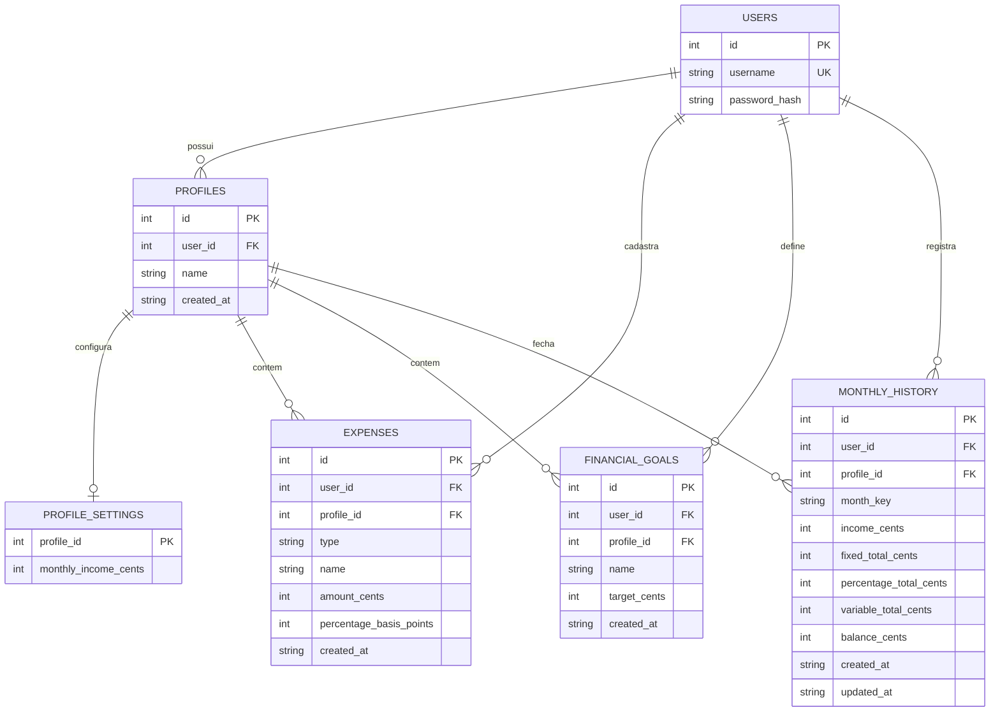

# Diagrama Entidade Relacionamento - Finance Manager

[Voltar para README](./README.md) · [Requisitos](./requisitos.md)

Diagrama do banco principal `data/financemanager.sqlite`.

A tabela de sessões (`data/sessions.sqlite`, gerenciada pelo `connect-sqlite3`) fica fora deste diagrama por ser infraestrutura de autenticação, não dado financeiro.

---

## Diagrama

---

## Entidades

### USERS
Usuários do sistema.

| Atributo | Tipo | Restrição |
| --- | --- | --- |
| id | INTEGER | PK, AUTOINCREMENT |
| username | TEXT | NOT NULL, UNIQUE |
| password_hash | TEXT | NOT NULL |

### PROFILES
Perfis financeiros de cada usuário.

| Atributo | Tipo | Restrição |
| --- | --- | --- |
| id | INTEGER | PK, AUTOINCREMENT |
| user_id | INTEGER | NOT NULL, FK → users.id |
| name | TEXT | NOT NULL |
| created_at | TEXT | NOT NULL, DEFAULT CURRENT_TIMESTAMP |

Restrição composta: `UNIQUE(user_id, name)`

### PROFILE_SETTINGS
Renda mensal de cada perfil.

| Atributo | Tipo | Restrição |
| --- | --- | --- |
| profile_id | INTEGER | PK, FK → profiles.id |
| monthly_income_cents | INTEGER | NOT NULL, DEFAULT 0 |

### EXPENSES
Gastos fixos, percentuais e variáveis.

| Atributo | Tipo | Restrição |
| --- | --- | --- |
| id | INTEGER | PK, AUTOINCREMENT |
| user_id | INTEGER | NOT NULL, FK → users.id |
| profile_id | INTEGER | FK → profiles.id |
| type | TEXT | NOT NULL (`fixed`, `percentage`, `variable`) |
| name | TEXT | NOT NULL |
| amount_cents | INTEGER | NOT NULL, DEFAULT 0 |
| percentage_basis_points | INTEGER | NOT NULL, DEFAULT 0 |
| created_at | TEXT | NOT NULL, DEFAULT CURRENT_TIMESTAMP |

### FINANCIAL_GOALS
Metas financeiras por perfil.

| Atributo | Tipo | Restrição |
| --- | --- | --- |
| id | INTEGER | PK, AUTOINCREMENT |
| user_id | INTEGER | NOT NULL, FK → users.id |
| profile_id | INTEGER | NOT NULL, FK → profiles.id |
| name | TEXT | NOT NULL |
| target_cents | INTEGER | NOT NULL |
| created_at | TEXT | NOT NULL, DEFAULT CURRENT_TIMESTAMP |

### MONTHLY_HISTORY
Fechamento mensal real por perfil.

| Atributo | Tipo | Restrição |
| --- | --- | --- |
| id | INTEGER | PK, AUTOINCREMENT |
| user_id | INTEGER | NOT NULL, FK → users.id |
| profile_id | INTEGER | NOT NULL, FK → profiles.id |
| month_key | TEXT | NOT NULL (`YYYY-MM`) |
| income_cents | INTEGER | NOT NULL, DEFAULT 0 |
| fixed_total_cents | INTEGER | NOT NULL, DEFAULT 0 |
| percentage_total_cents | INTEGER | NOT NULL, DEFAULT 0 |
| variable_total_cents | INTEGER | NOT NULL, DEFAULT 0 |
| balance_cents | INTEGER | NOT NULL, DEFAULT 0 |
| created_at | TEXT | NOT NULL, DEFAULT CURRENT_TIMESTAMP |
| updated_at | TEXT | NOT NULL, DEFAULT CURRENT_TIMESTAMP |

Restrição composta: `UNIQUE(profile_id, month_key)`

---

## Relacionamentos

| De | Para | Cardinalidade | Descrição |
| --- | --- | --- | --- |
| users | profiles | 1:N | Um usuário possui vários perfis financeiros |
| profiles | profile_settings | 1:1 | Cada perfil tem uma configuração de renda |
| users | expenses | 1:N | Gastos vinculados ao usuário |
| profiles | expenses | 1:N | Gastos agrupados por perfil |
| users | financial_goals | 1:N | Metas vinculadas ao usuário |
| profiles | financial_goals | 1:N | Metas agrupadas por perfil |
| users | monthly_history | 1:N | Histórico vinculado ao usuário |
| profiles | monthly_history | 1:N | Um fechamento por mês em cada perfil |

---

## Observações

- `user_id` em `expenses`, `financial_goals` e `monthly_history` é redundante em relação ao perfil, mas existe no código para filtrar queries diretamente pelo usuário logado.
- `profile_settings.profile_id` é chave primária e estrangeira ao mesmo tempo (1:1 com `profiles`).
- Valores monetários são sempre inteiros em centavos.
