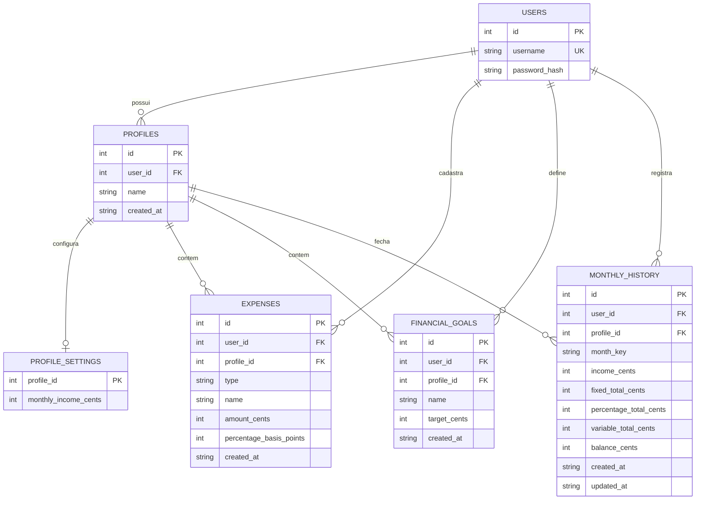

# Levantamento de Requisitos - Finance Manager

[Voltar para README](./README.md)

---

## 1. Visão Geral

O Finance Manager é uma aplicação web local de controle financeiro pessoal desenvolvida em Node.js/Express com TypeScript. O sistema permite que o usuário registre renda, gastos e metas financeiras em perfis separados (casa, faculdade, trabalho etc.), com dashboard protegida por sessão e persistência em SQLite.

**URL local**: `http://localhost:3000`  
**Porta padrão**: 3000  
**Ambiente**: Local (sem APIs externas)

---

## Índice

- [1. Visão Geral](#1-visão-geral)
- [2. Requisitos Funcionais](#2-requisitos-funcionais)
- [3. Requisitos Não Funcionais](#3-requisitos-não-funcionais)
- [4. Arquitetura e Tecnologias](#4-arquitetura-e-tecnologias)
  - [4.5 Banco de Dados](#45-banco-de-dados)
- [5. Variáveis de Ambiente](#5-variáveis-de-ambiente)
- [6. Rotas da Aplicação](#6-rotas-da-aplicação)
- [7. Segurança Implementada](#7-segurança-implementada)
- [8. Execução e Build](#8-execução-e-build)

---

## 2. Requisitos Funcionais

### 2.1 Autenticação e Sessão

**Registro de Usuário**
- Sistema permite registro com nome de usuário e senha
- Nome de usuário único no sistema (mínimo 3, máximo 40 caracteres)
- Senha mínima de 6 caracteres, criptografada com bcrypt (12 rounds)
- Após registro, usuário é autenticado automaticamente
- Perfil financeiro `Padrão` criado automaticamente
- Rotas: `GET /register`, `POST /register`

**Login de Usuário**
- Autenticação com nome de usuário e senha
- Comparação de senha com hash armazenado
- Sessão criada no servidor com cookie `financemanager.sid`
- Perfil ativo inicial definido na sessão
- Redirecionamento para `/dashboard` após login
- Rotas: `GET /login`, `POST /login`

**Logout**
- Destruição da sessão no servidor
- Limpeza do cookie de sessão
- Redirecionamento para `/login`
- Rota: `POST /logout`

**Proteção de Rotas**
- Middleware `requireLogin` em rotas protegidas
- Usuários sem sessão redirecionados para `/login`
- Usuários logados em `/login` ou `/register` redirecionados para `/dashboard`
- `GET /` redireciona para login ou dashboard conforme sessão

**Usuário Admin Inicial (opcional)**
- Se `DEFAULT_ADMIN_PASSWORD` estiver definida e não existir usuário `admin`, o sistema cria automaticamente na inicialização
- Sem comportamento especial de painel; funciona como usuário comum

### 2.2 Perfis Financeiros

**Perfil Padrão**
- Todo usuário possui ao menos um perfil chamado `Padrão`
- Criado no cadastro ou na primeira carga de dados
- Usuários antigos sem perfil recebem um automaticamente

**Criação de Perfil**
- Usuário autenticado pode criar perfis com nome personalizado (máx. 40 caracteres)
- Não permite duplicar nome de perfil para o mesmo usuário
- Novo perfil criado passa a ser o perfil ativo
- Rota: `POST /profiles`

**Seleção de Perfil Ativo**
- Usuário escolhe qual perfil visualizar/editar
- Perfil ativo armazenado na sessão (`activeProfileId`)
- Renda, gastos, metas e histórico são isolados por perfil
- Rota: `POST /profiles/select`

### 2.3 Renda e Gastos

**Renda Mensal**
- Cadastro ou atualização da renda mensal do perfil ativo
- Valor convertido para centavos antes de salvar
- Valores inválidos ou negativos tratados como zero
- Rota: `POST /income`

**Gastos Fixos**
- Cadastro com nome e valor fixo mensal
- Edição e remoção de gastos existentes
- Vinculados ao usuário logado e ao perfil ativo
- Rotas: `POST /expenses/fixed`, `POST /expenses/:id/fixed`, `POST /expenses/:id/delete`

**Gastos Percentuais**
- Cadastro com nome e percentual sobre a renda mensal
- Percentual salvo em pontos-base (ex.: 10% = 1000)
- Percentuais inválidos viram zero; acima de 100% limitados a 100%
- Valor em dinheiro calculado na exibição: `renda × percentual / 100`
- Rotas: `POST /expenses/percentage`, `POST /expenses/:id/percentage`, `POST /expenses/:id/delete`

**Gastos Variáveis**
- Cadastro com nome e valor atual
- Último valor salvo usado nos cálculos e na projeção dos próximos meses
- Rotas: `POST /expenses/variable`, `POST /expenses/:id/variable`, `POST /expenses/:id/delete`

**Cálculo do Saldo Mensal**

```text
saldo = renda mensal - gastos fixos - gastos percentuais - gastos variáveis
```

### 2.4 Dashboard e Previsão

**Resumo Financeiro**
- Exibe renda, totais de gastos (fixos, percentuais, variáveis), saldo mensal e saldo acumulado
- Dados carregados conforme perfil ativo
- Rota: `GET /dashboard`

**Gráfico Simples**
- Barras proporcionais para entrada, fixos, percentuais, variáveis e saldo mensal
- Saldo negativo exibido com cor distinta

**Previsão por Data**
- Usuário seleciona data entre hoje e até 1 ano à frente
- Tabela mês a mês com renda, gastos, saldo e saldo acumulado
- Assume renda e gastos constantes em todos os meses projetados
- Saldo acumulado = `saldo mensal × número de meses`
- Parâmetro: `GET /dashboard?date=YYYY-MM-DD`

### 2.5 Metas Financeiras

**Cadastro e Edição**
- Meta com nome e valor alvo
- Vinculada ao usuário e ao perfil ativo
- Metas com valor zero ou inválido não são salvas
- Rotas: `POST /goals`, `POST /goals/:id`, `POST /goals/:id/delete`

**Previsão de Metas**
- Calculada com base no saldo mensal atual
- Se saldo mensal ≤ 0: exibe "sem previsão"
- Se saldo positivo: estima mês/ano e quantidade de meses para atingir o valor
- Barra de progresso usa saldo acumulado projetado

### 2.6 Histórico Mensal

**Salvar Fechamento**
- Usuário escolhe mês/ano (`YYYY-MM`)
- Sistema salva renda, totais de gastos e saldo do momento
- Se já existir fechamento para o mesmo perfil e mês, atualiza o registro
- Rota: `POST /history/save`

**Listagem**
- Exibe até os 12 fechamentos mais recentes do perfil ativo
- Ordenação do mês mais recente para o mais antigo
- Mostra entrada, gastos e saldo de cada mês

**Remoção**
- Rota: `POST /history/:id/delete`

### 2.7 Interface do Usuário

**Página de Login** (`/login`)
- Formulário com usuário e senha
- Link para cadastro
- HTML gerado no servidor

**Página de Cadastro** (`/register`)
- Formulário com usuário e senha
- Link para login
- HTML gerado no servidor

**Dashboard** (`/dashboard`)
- Tema escuro, layout em cards responsivo
- Seletor e criação de perfis no topo
- Cards de renda, gastos, balanço, gráfico, previsão, metas e histórico
- Formulários embutidos na própria página (sem SPA)
- Requer sessão ativa

---

## 3. Requisitos Não Funcionais

**Performance**
- Aplicação local, sem dependência de serviços externos
- Respostas síncronas com SQLite em arquivo local

**Segurança**
- Senhas com hash bcrypt
- Sessão com cookie `httpOnly` e `sameSite: lax`
- `secure: true` quando `NODE_ENV=production`
- Escape HTML em textos exibidos na interface
- Dados financeiros isolados por usuário e perfil

**Confiabilidade**
- Tratamento global de erro 500
- Migração automática de esquema na inicialização do banco

**Manutenibilidade**
- TypeScript com `strict: true`
- Código concentrado em `src/index.ts`

**Usabilidade**
- Interface em português (pt-BR)
- Valores monetários formatados em BRL
- Layout responsivo para telas menores

**Privacidade**
- Dados armazenados apenas no SQLite local
- Sem envio de dados financeiros para APIs externas

---

## 4. Arquitetura e Tecnologias

**Stack Tecnológico**

Backend:
- Node.js
- Express.js v4.21.2
- TypeScript 5.7.3
- SQLite (sqlite3 v5.1.7)
- express-session v1.18.1
- connect-sqlite3 v0.9.16
- bcrypt v6.0.0

Frontend:
- HTML/CSS gerado no servidor (SSR manual)
- Sem framework JavaScript no cliente

Ferramentas:
- TypeScript Compiler (`tsc`)
- tsx v4.19.2 (desenvolvimento)

**Estrutura de Diretórios**

```
financemanager/
├── src/
│   └── index.ts         # Servidor, rotas, banco e páginas HTML
├── index.js             # Entry point da versão compilada
├── package.json
├── tsconfig.json
├── README.md
├── requisitos.md
├── .env                 # Variáveis de ambiente (local)
├── data/                # Banco e sessões (não versionado)
│   ├── financemanager.sqlite
│   └── sessions.sqlite
└── dist/                # Código compilado
```

**Fluxo de Requisição**

1. Requisição HTTP → Express
2. Parser de body (`application/x-www-form-urlencoded`)
3. Middleware de sessão (`express-session` + SQLite store)
4. Roteamento:
   - Rotas públicas → login/registro
   - Rotas protegidas → `requireLogin`
5. Consulta/gravação no SQLite
6. Resposta HTML ou redirect

### 4.5 Banco de Dados

**Tecnologia e Configuração**
- **SGBD**: SQLite
- **Biblioteca**: sqlite3 v5.1.7
- **Arquivo principal**: `data/financemanager.sqlite`
- **Sessões**: `data/sessions.sqlite` (via connect-sqlite3)

**Diagrama Entidade Relacionamento**

Documento completo: [DiagramaER.md](./DiagramaER.md)

Diagrama do banco principal `data/financemanager.sqlite`. A tabela de sessões (`data/sessions.sqlite`) fica fora por ser infraestrutura de autenticação, não dado financeiro.



**Entidades**

**USERS** — usuários do sistema.

| Atributo | Tipo | Restrição |
| --- | --- | --- |
| id | INTEGER | PK, AUTOINCREMENT |
| username | TEXT | NOT NULL, UNIQUE |
| password_hash | TEXT | NOT NULL |

**PROFILES** — perfis financeiros de cada usuário.

| Atributo | Tipo | Restrição |
| --- | --- | --- |
| id | INTEGER | PK, AUTOINCREMENT |
| user_id | INTEGER | NOT NULL, FK → users.id |
| name | TEXT | NOT NULL |
| created_at | TEXT | NOT NULL, DEFAULT CURRENT_TIMESTAMP |

Restrição composta: `UNIQUE(user_id, name)`

**PROFILE_SETTINGS** — renda mensal de cada perfil.

| Atributo | Tipo | Restrição |
| --- | --- | --- |
| profile_id | INTEGER | PK, FK → profiles.id |
| monthly_income_cents | INTEGER | NOT NULL, DEFAULT 0 |

**EXPENSES** — gastos fixos, percentuais e variáveis.

| Atributo | Tipo | Restrição |
| --- | --- | --- |
| id | INTEGER | PK, AUTOINCREMENT |
| user_id | INTEGER | NOT NULL, FK → users.id |
| profile_id | INTEGER | FK → profiles.id |
| type | TEXT | NOT NULL (`fixed`, `percentage`, `variable`) |
| name | TEXT | NOT NULL |
| amount_cents | INTEGER | NOT NULL, DEFAULT 0 |
| percentage_basis_points | INTEGER | NOT NULL, DEFAULT 0 |
| created_at | TEXT | NOT NULL, DEFAULT CURRENT_TIMESTAMP |

**FINANCIAL_GOALS** — metas financeiras por perfil.

| Atributo | Tipo | Restrição |
| --- | --- | --- |
| id | INTEGER | PK, AUTOINCREMENT |
| user_id | INTEGER | NOT NULL, FK → users.id |
| profile_id | INTEGER | NOT NULL, FK → profiles.id |
| name | TEXT | NOT NULL |
| target_cents | INTEGER | NOT NULL |
| created_at | TEXT | NOT NULL, DEFAULT CURRENT_TIMESTAMP |

**MONTHLY_HISTORY** — fechamento mensal real por perfil.

| Atributo | Tipo | Restrição |
| --- | --- | --- |
| id | INTEGER | PK, AUTOINCREMENT |
| user_id | INTEGER | NOT NULL, FK → users.id |
| profile_id | INTEGER | NOT NULL, FK → profiles.id |
| month_key | TEXT | NOT NULL (`YYYY-MM`) |
| income_cents | INTEGER | NOT NULL, DEFAULT 0 |
| fixed_total_cents | INTEGER | NOT NULL, DEFAULT 0 |
| percentage_total_cents | INTEGER | NOT NULL, DEFAULT 0 |
| variable_total_cents | INTEGER | NOT NULL, DEFAULT 0 |
| balance_cents | INTEGER | NOT NULL, DEFAULT 0 |
| created_at | TEXT | NOT NULL, DEFAULT CURRENT_TIMESTAMP |
| updated_at | TEXT | NOT NULL, DEFAULT CURRENT_TIMESTAMP |

Restrição composta: `UNIQUE(profile_id, month_key)`

**Relacionamentos**

| De | Para | Cardinalidade | Descrição |
| --- | --- | --- | --- |
| users | profiles | 1:N | Um usuário possui vários perfis financeiros |
| profiles | profile_settings | 1:1 | Cada perfil tem uma configuração de renda |
| users | expenses | 1:N | Gastos vinculados ao usuário |
| profiles | expenses | 1:N | Gastos agrupados por perfil |
| users | financial_goals | 1:N | Metas vinculadas ao usuário |
| profiles | financial_goals | 1:N | Metas agrupadas por perfil |
| users | monthly_history | 1:N | Histórico vinculado ao usuário |
| profiles | monthly_history | 1:N | Um fechamento por mês em cada perfil |

**Observações**
- `user_id` em `expenses`, `financial_goals` e `monthly_history` é redundante em relação ao perfil, mas existe no código para filtrar queries pelo usuário logado.
- `profile_settings.profile_id` é chave primária e estrangeira ao mesmo tempo (1:1 com `profiles`).
- Valores monetários são sempre inteiros em centavos.

---

## 5. Variáveis de Ambiente

Arquivo `.env` na raiz do projeto:

```env
SESSION_SECRET=uma_chave_para_assinar_a_sessao
DEFAULT_ADMIN_PASSWORD=senha_do_usuario_admin_inicial
PORT=3000
```

| Variável | Obrigatória | Padrão | Descrição |
| --- | --- | --- | --- |
| `SESSION_SECRET` | Sim | — | Chave para assinar a sessão. Servidor não inicia sem ela. |
| `DEFAULT_ADMIN_PASSWORD` | Não | — | Cria usuário `admin` na primeira execução, se ainda não existir. |
| `PORT` | Não | `3000` | Porta HTTP do servidor. |
| `NODE_ENV` | Não | — | Quando `production`, cookie de sessão usa `secure: true`. |

- `.env` não deve ser versionado
- Variáveis carregadas por parser manual no início de `src/index.ts`

---

## 6. Rotas da Aplicação

**Rotas Públicas**

| Método | Rota | Descrição |
| --- | --- | --- |
| `GET` | `/` | Redireciona para login ou dashboard |
| `GET` | `/login` | Página de login |
| `POST` | `/login` | Autentica usuário |
| `GET` | `/register` | Página de cadastro |
| `POST` | `/register` | Cria conta e perfil padrão |

**Rotas Protegidas (sessão)**

| Método | Rota | Descrição |
| --- | --- | --- |
| `GET` | `/dashboard` | Dashboard financeira (`?date=`, `?month=`) |
| `POST` | `/logout` | Encerra sessão |
| `POST` | `/profiles` | Cria perfil financeiro |
| `POST` | `/profiles/select` | Seleciona perfil ativo |
| `POST` | `/income` | Salva renda mensal |
| `POST` | `/expenses/fixed` | Adiciona gasto fixo |
| `POST` | `/expenses/:id/fixed` | Edita gasto fixo |
| `POST` | `/expenses/percentage` | Adiciona gasto percentual |
| `POST` | `/expenses/:id/percentage` | Edita gasto percentual |
| `POST` | `/expenses/variable` | Adiciona gasto variável |
| `POST` | `/expenses/:id/variable` | Edita gasto variável |
| `POST` | `/expenses/:id/delete` | Remove gasto |
| `POST` | `/goals` | Adiciona meta |
| `POST` | `/goals/:id` | Edita meta |
| `POST` | `/goals/:id/delete` | Remove meta |
| `POST` | `/history/save` | Salva fechamento mensal |
| `POST` | `/history/:id/delete` | Remove fechamento |

Todas as ações de escrita usam `application/x-www-form-urlencoded` e redirecionam para `/dashboard`.

---

## 7. Segurança Implementada

- Sessão no servidor com `express-session`
- Armazenamento de sessão em SQLite (`connect-sqlite3`)
- Cookie `financemanager.sid` com `httpOnly` e `sameSite: lax`
- `session.regenerate` no login e no cadastro
- Senhas criptografadas com bcrypt (12 rounds)
- `SESSION_SECRET` obrigatória para iniciar o servidor
- Escape HTML em dados exibidos na interface
- Queries filtradas por `user_id` e `profile_id` da sessão
- Valores monetários persistidos em centavos inteiros
- Dados sensíveis apenas no `.env` local (não versionado)

**Não implementado**
- Proteção CSRF em formulários POST
- Rate limiting em login/cadastro

---

## 8. Execução e Build

**Instalação**
```bash
npm install
```

**Desenvolvimento**
```bash
npm run dev
```

**Compilação**
```bash
npm run build
```

**Produção local**
```bash
npm start
```

A aplicação sobe em `http://localhost:3000` (ou na porta definida em `PORT`).
